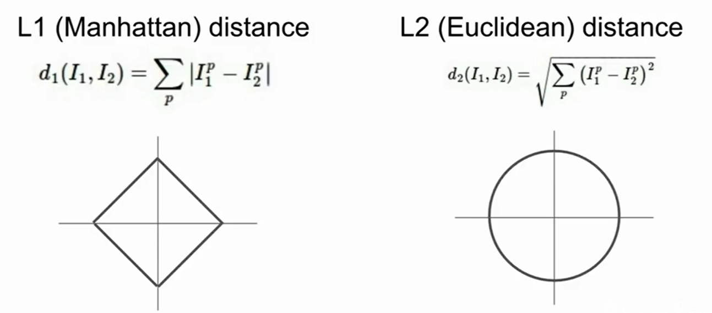
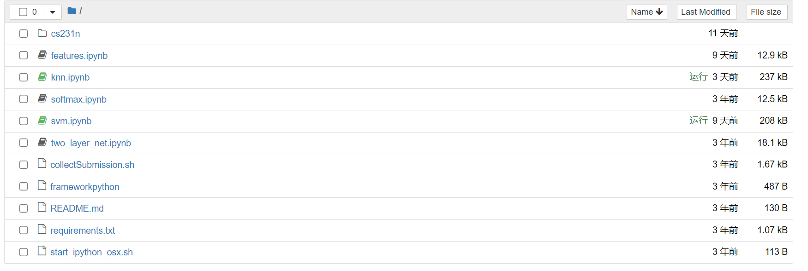
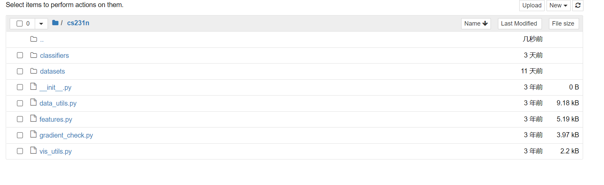
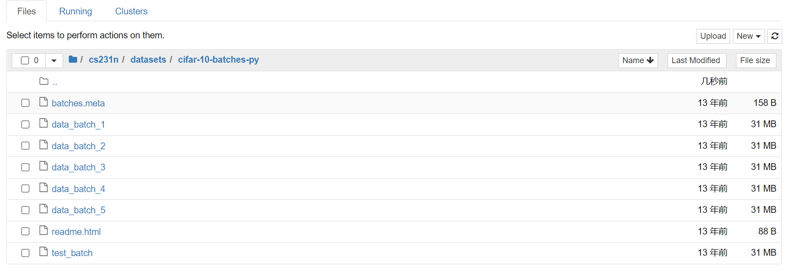
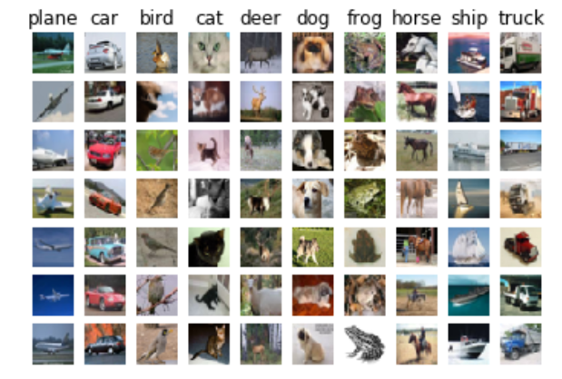

# 监督学习算法之KNN

**在所有开始之前，希望你的作业需要的环境都是已经配置好的！**


## 1.文章结构

### 1.1 图像相似性度量

### 1.2 介绍NN算法

### 1.3 介绍KNN算法

### 1.4 算法分析

### 1.5 讲解Assignment 1中的KNN相关部分


## 2. 图像相似性度量

“图像识别或图像分类”这一目的决定了我们需要度量图像的相似性。或许我们的任务流程就变成如下：

输入一张测试图像，从训练集的图像中选出一张与其最相似的，将测试图像归类到训练集图像类别中。

(因为我们采用的是监督学习模式，训练集的图像都是有明确类别标注的。)

### 2.1 L1距离

L1距离又称为曼哈顿距离，如果把两张图像视作两个矩阵，那么L1距离就是两张图像逐像素之差的绝对值求和。

### 2.2 L2距离

L2距离又称为欧几里得距离，距离计算方法为，两张图像逐像素平方求和最后开方。


两距离用图像表示：



初看图像有点难以理解。实际上，上图是指：**当固定两图像的距离时，且I1固定为原点，I2可以所处的所有位置。**比如左图，I2到原点的横纵坐标相加总是一个固定值，而右图中l2到原点的横纵坐标平方和开方总是一个固定值即为圆的半径。

而这样的特性告诉我们L1距离是坐标系依赖的，即当我们旋转坐标轴时整个图像也会动，L2则会显得平滑很多。

(这里的理解可能也不够深刻！！望指正)


**而在作业中算法实现基本用的都是L2距离。**


## 3. NN算法

NN是nearest-neighbor的缩写，直译过来就是最近邻算法。该算法的核心思想就是对于一张输入图像，从训练集中找到与其相似性最高的为解。

算法的主要步骤：train训练过程什么都不用干，仅仅是记住整个训练集图像。predict预测阶段就是将输入图像与每一张训练集中的图像比对，选出相似性最高的解。

时间复杂度上，训练过程是O(1)的，预测过程则是O(n)。


## 4. KNN算法

KNN是k-nearest-neighbor的缩写，其实就是对NN算法的一种改进。在NN的基础上，不仅仅是选取相似性最高的单张图像，取而代之的是选取前k张相似性最高的图像，在这k张图像里进行投票，选取投票数最高的类别为解。

算法的主要步骤：同NN，只不过在predict预测阶段需要选取top-k张图像，然后投票选类别。

这一改进算法可以起到平滑决策边界的作用，可以避免因为图像失真、噪声干扰引起的误差。


## 5. 算法分析

很简单，但可以说是完全背离了现代深度学习的理念。

现在都是希望训练过程是缓慢的，这一步骤会统一放在数据中心处理，然后训练出来一个很好的模型。这个简单的模型就是一个分类器，将其部署到终端上，然后预测阶段应该是很快很准的。


## 6. Assignment 1 - KNN

除了完成作业，享受coding的快感，个人认为这份作业的项目结构也很值得学习。很多从github上下载下来的深度学习的项目都是这样的结构，以后自己写项目都可以模仿。

关于结构，后面的作业内容里也不会再赘述，这里稍微插一嘴。



README工程文档，是对工程的一个概述。

requirements是此工程依赖的第三方库。

.sh文件是Linux操作系统下的脚本文件。

ipynb是jupyter notebook特有的可以分块运行python代码的文件，在cs231n文件夹中格式如下：



classifier文件夹包含了本次作业要实现的knn、svm、线性分类器等多个分类器。

datasets里是本次作业用到的cifar-10数据集。

本页的其他.py文件都是一些功能性函数，用到的时候会提到。


### 6.1 knn ipynb分析

[1] 设置了matplotlib的特性，比如可以内联显示，设置图像大小、差值、颜色。

```python
# Run some setup code for this notebook.

import random
import numpy as np
from cs231n.data_utils import load_CIFAR10
import matplotlib.pyplot as plt

# This is a bit of magic to make matplotlib figures appear inline in the notebook
# rather than in a new window.
%matplotlib inline
plt.rcParams['figure.figsize'] = (10.0, 8.0) # set default size of plots
plt.rcParams['image.interpolation'] = 'nearest'
plt.rcParams['image.cmap'] = 'gray'

# Some more magic so that the notebook will reload external python modules;
# see http://stackoverflow.com/questions/1907993/autoreload-of-modules-in-ipython
%load_ext autoreload
%autoreload 2
```


[2] 主要是读取数据集，在此之前设置数据集路径，清空变量。然后对数据集的shape进行打印。

```python
# Load the raw CIFAR-10 data.
cifar10_dir = 'cs231n/datasets/cifar-10-batches-py'

# Cleaning up variables to prevent loading data multiple times (which may cause memory issue)
try:
   del X_train, y_train
   del X_test, y_test
   print('Clear previously loaded data.')
except:
   pass

X_train, y_train, X_test, y_test = load_CIFAR10(cifar10_dir)

# As a sanity check, we print out the size of the training and test data.
print('Training data shape: ', X_train.shape)
print('Training labels shape: ', y_train.shape)
print('Test data shape: ', X_test.shape)
print('Test labels shape: ', y_test.shape)
```

数据集读取在data_utils，也就是一开始说的功能性函数里。循环了五次，将每次读出的训练集数据分别放在xs、ys中。concatenate可以将此列表中的所有数据按列堆叠起来。

```python
def load_CIFAR10(ROOT):
    """ load all of cifar """
    xs = []
    ys = []
    for b in range(1,6):
        f = os.path.join(ROOT, 'data_batch_%d' % (b, ))
        X, Y = load_CIFAR_batch(f)
        xs.append(X)
        ys.append(Y)
    Xtr = np.concatenate(xs)
    Ytr = np.concatenate(ys)
    del X, Y
    Xte, Yte = load_CIFAR_batch(os.path.join(ROOT, 'test_batch'))
    return Xtr, Ytr, Xte, Yte
```

打印出的数据shape为：

```python
Training data shape:  (50000, 32, 32, 3)
Training labels shape:  (50000,)
Test data shape:  (10000, 32, 32, 3)
Test labels shape:  (10000,)
```

读取5次也是基于数据集共有5个数据包，如下图所示：



[3] 数据可视化。 声明了包含所有类的列表，flatnonzero可以返回列表中所有非0元素的下标。y_train == y是直接拿一个列表在与一个值比较，那么会返回一个(50000,)的列表，其中相同的位置置为1，否则置0。因此才需要找到非0元素的下标！但实际显示我们只从中随机选出7个。

```python
# Visualize some examples from the dataset.
# We show a few examples of training images from each class.
classes = ['plane', 'car', 'bird', 'cat', 'deer', 'dog', 'frog', 'horse', 'ship', 'truck']
num_classes = len(classes)
samples_per_class = 7
for y, cls in enumerate(classes):
    idxs = np.flatnonzero(y_train == y)
    idxs = np.random.choice(idxs, samples_per_class, replace=False)
    for i, idx in enumerate(idxs):
        plt_idx = i * num_classes + y + 1
        plt.subplot(samples_per_class, num_classes, plt_idx)
        plt.imshow(X_train[idx].astype('uint8'))
        plt.axis('off')
        if i == 0:
            plt.title(cls)
plt.show()
```

显示结果：



[4] 数据降维和剪切。训练集和测试集都只取原先的一部分。降维就是指把原先(32, 32, 3)----(32行，32列，3通道的彩色图像转为一维的行向量)。

```python
# Subsample the data for more efficient code execution in this exercise
num_training = 5000
mask = list(range(num_training))
X_train = X_train[mask]
y_train = y_train[mask]

num_test = 500
mask = list(range(num_test))
X_test = X_test[mask]
y_test = y_test[mask]

# Reshape the image data into rows
X_train = np.reshape(X_train, (X_train.shape[0], -1))
X_test = np.reshape(X_test, (X_test.shape[0], -1))
print(X_train.shape, X_test.shape)
```

[5] 分类器创建与模型预测。就是从类创建一个对象，传入训练集，指定k，对测试集进行预测并统计正确率。

```python
from cs231n.classifiers import KNearestNeighbor

# Create a kNN classifier instance. 
# Remember that training a kNN classifier is a noop: 
# the Classifier simply remembers the data and does no further processing 
classifier = KNearestNeighbor()
classifier.train(X_train, y_train)

# Open cs231n/classifiers/k_nearest_neighbor.py and implement
# compute_distances_two_loops.

# Test your implementation:
dists = classifier.compute_distances_two_loops(X_test)
print(dists.shape)

# Now implement the function predict_labels and run the code below:
# We use k = 1 (which is Nearest Neighbor).
y_test_pred = classifier.predict_labels(dists, k=1)

# Compute and print the fraction of correctly predicted examples
num_correct = np.sum(y_test_pred == y_test)
accuracy = float(num_correct) / num_test
print('Got %d / %d correct => accuracy: %f' % (num_correct, num_test, accuracy))
```


### 6.2 k nearest neighbor 分类器分析

#### 6.2.1 训练集处理

正如算法简介中所说，训练过程就是一个memorize的过程，即将传入的训练集以及其相应的类别保存下来。

```python
from builtins import range
from builtins import object
import numpy as np
from past.builtins import xrange


class KNearestNeighbor(object):
    """ a kNN classifier with L2 distance """

    def __init__(self):
        pass

    def train(self, X, y):
        """
        Train the classifier. For k-nearest neighbors this is just
        memorizing the training data.

        Inputs:
        - X: A numpy array of shape (num_train, D) containing the training data
          consisting of num_train samples each of dimension D.
        - y: A numpy array of shape (N,) containing the training labels, where
             y[i] is the label for X[i].
        """
        self.X_train = X
        self.y_train = y
```

#### 6.2.2 计算图像距离矩阵的三种方式

假设有test_num张测试图像，有train_num张训练集图像，那么距离矩阵大小为(test_num, train_num)，其中坐标为(test_i, train_j)元素含义为第i张测试图像与第j张训练图像的L2距离。

------------------------------------------------------------------------------------------------------------

**下列代码里的平方，开方实际上也可以直接用(np.square, np.sqrt)更简洁地实现**

------------------------------------------------------------------------------------------------------------

1.双重循环

很简单，用两重循环分别从测试集和训练集取出单张图像，计算距离，然后填充到距离矩阵中。

代码也很容易理解，如下所示：

```python
def compute_distances_two_loops(self, X):
        """
        Compute the distance between each test point in X and each training point
        in self.X_train using a nested loop over both the training data and the
        test data.

        Inputs:
        - X: A numpy array of shape (num_test, D) containing test data.

        Returns:
        - dists: A numpy array of shape (num_test, num_train) where dists[i, j]
          is the Euclidean distance between the ith test point and the jth training
          point.
        """
        num_test = X.shape[0]
        num_train = self.X_train.shape[0]
        dists = np.zeros((num_test, num_train))
        for i in range(num_test):
            for j in range(num_train):
                #####################################################################
                # TODO:                                                             #
                # Compute the l2 distance between the ith test point and the jth    #
                # training point, and store the result in dists[i, j]. You should   #
                # not use a loop over dimension, nor use np.linalg.norm().          #
                #####################################################################
                # *****START OF YOUR CODE (DO NOT DELETE/MODIFY THIS LINE)*****
                
                #L2距离，就是两矩阵做差，平方，求和，开方
                Diff = np.power(np.sum(np.power(X[i] - self.X_train[j], 2)), 1/2)
                dists[i, j] = Diff
                

                # *****END OF YOUR CODE (DO NOT DELETE/MODIFY THIS LINE)*****
        return dists

```

2.单重循环

我不知道正确答案是什么。仅提供个人思路：

从测试集中取出一张图片，形状应该是(3072,)。此时利用python的广播机制，直接让训练集矩阵(5000, 3072)减去这一张图像，**实际上训练集矩阵每一行都会减去这张图像。**这样一来，减法得到的矩阵就是第i张测试集图像与训练集所有图像的差值矩阵了。

最后再对这个差值矩阵平方，按行求和，开方，就会得到(5000, )的数组。这个数组就是第i张测试集图像和所有训练集图像的距离，填充回矩阵的相应行即可。

```python
def compute_distances_one_loop(self, X):
        """
        Compute the distance between each test point in X and each training point
        in self.X_train using a single loop over the test data.

        Input / Output: Same as compute_distances_two_loops
        """
        num_test = X.shape[0]
        num_train = self.X_train.shape[0]
        dists = np.zeros((num_test, num_train))
        for i in range(num_test):
            #######################################################################
            # TODO:                                                               #
            # Compute the l2 distance between the ith test point and all training #
            # points, and store the result in dists[i, :].                        #
            # Do not use np.linalg.norm().                                        #
            #######################################################################
            # *****START OF YOUR CODE (DO NOT DELETE/MODIFY THIS LINE)*****
            
            # 1. 利用numpy的广播性质，用train矩阵直接减test的某一行，即可
            Diff_array = self.X_train - X[i]
            # 2. 从axis = 1，即对每一行平方求和(axis = 0是列)，会得到(5000,)的数组，在此基础上做pixel-wise的开方，最后放回dists原处
            dists[i,:] = np.power(np.sum(np.power(Diff_array, 2), axis = 1), 1/2)
            
            

            # *****END OF YOUR CODE (DO NOT DELETE/MODIFY THIS LINE)*****
        return dists

```

3.不用循环

本人一开始是真没想到，也属于是思考的方向错了。

其实用的是挺简单的


#### 6.2.3 预测

